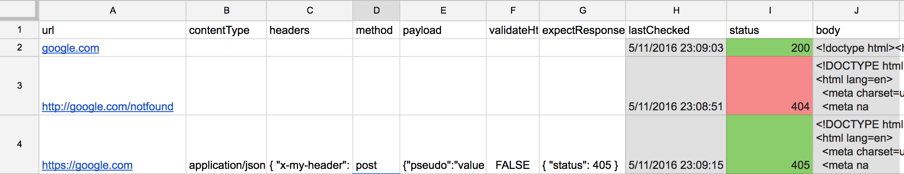

# install
Gogole Drive > create spread sheet > tools > script editor > paste main.js > save > run onOpen

- the name of the spreadsheet, and the google apps script can be whatever you want
- onOpen will be called every time you open the spreadsheet
- onOpen creates `Custom Menu`

## sample spreadsheet

```
pbcopy < sample-sheet.txt
```

and paste to the spreadsheet

- lines below the line begin with `#` will be ignored by the script

## test run

Custom Menu > check right now

# schedule
Tools > Script editor... > Resources > Current project's triggers > select healthCheck as a function

- my recommendation is to set the interval to every 5 minutes or later
- trigger will be executed even if you close the spreadsheet

# custom menu
|menu|description|
|:--|:--|
|health check list|make sure health check list was parsed|
|check right now|start checking according to the list|
|notification settings|such as Slack webhook url, or kind of|
|output settings|limit of response body|
|help|show helps|

# properties
|name|default|description|
|:--|:--|:--|
|url|(none)|`http://` is not required|
|contentType|`application/x-www-form-urlencoded`|it may be `application/json; charset=utf-8`, or whatever|
|headers|(none)|like `{ "x-my-header": "foobar" }`|
|method|get|it may be `post`, `put`, or `delete`|
|payload|(none)|request body, the format is depend on the contentType|
|validateHttpsCertificate|true|don't try to validate if it's set to false|
|expectResponse|`{ "status": 200 }`|like, `{ "status": 200, "body": "pong" }`|

# how to setup Slack notification
|purpose|howto|
|:--|:--|
|create|https://slack.com/apps > Build > Make a custom integration > Incoming Webhooks|
|check|https://slack.com/apps > Manage > Custom Integrations|

# links
- https://developers.google.com/apps-script/reference/spreadsheet/sheet
- https://developers.google.com/apps-script/reference/url-fetch/http-response
- https://developers.google.com/apps-script/reference/url-fetch/url-fetch-app
